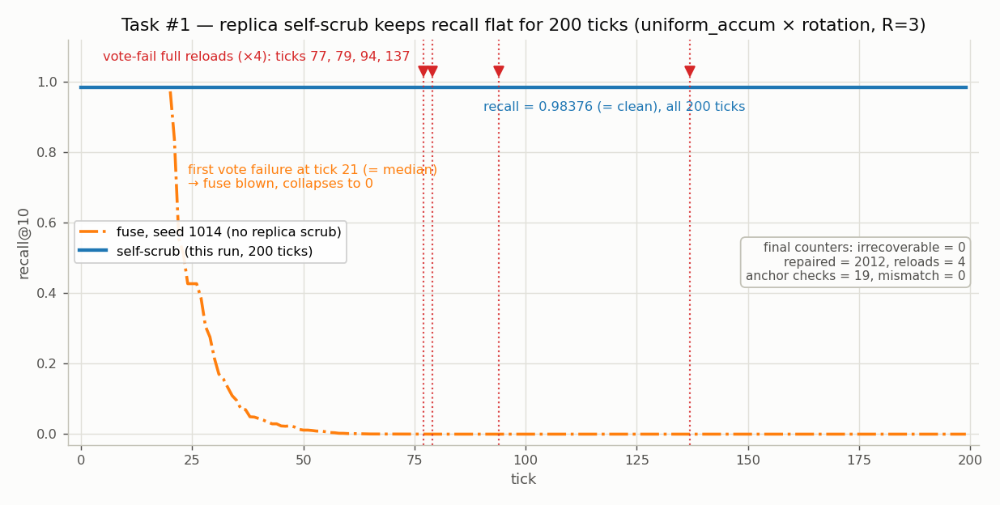
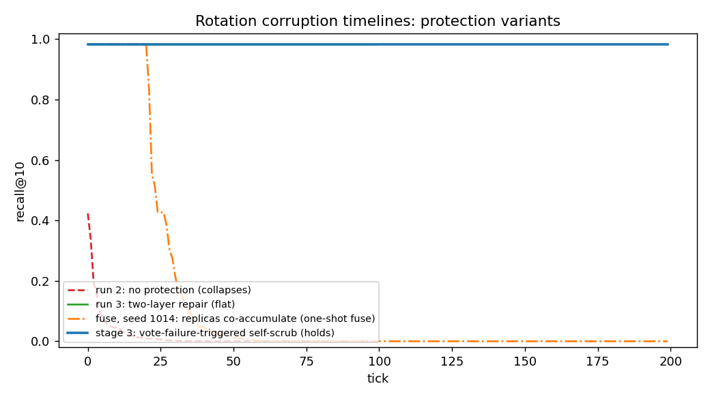
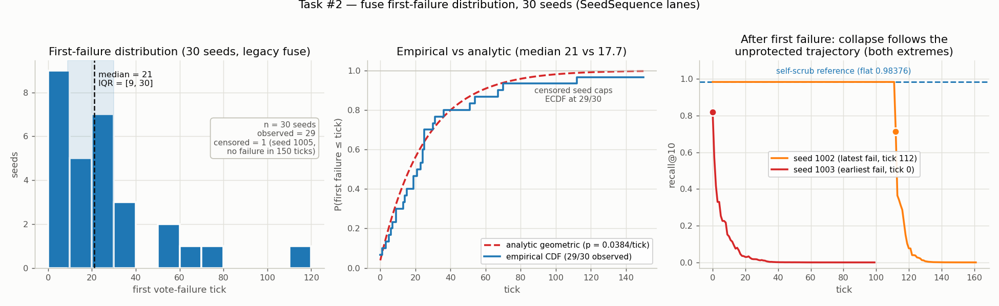
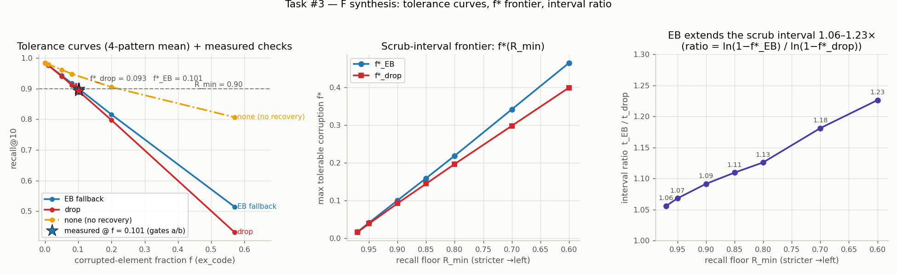
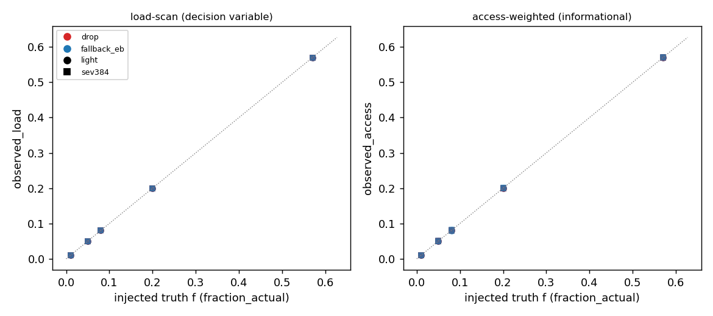

# Stage 3 結果分析 — 複本自我 scrub × 首失敗分布 × F 合成驗證 × G 偵測

**日期**:2026-07-10(正式跑於 2026-07-09,x86-64 工作站 meow1,`run_stage3_x86.sh` A→B→C→D 循序)
**索引**:RaBitQ-HNSW b=7、SIFT1M、M=16、efC=200、L2;查詢 k=10、ef=2000(plateau)
**乾淨基線**:recall@10 = **0.98376**(Stage 0 錨點,本輪所有 run 重現;faiss 1.14.2 / numpy 2.4.6)
**規格**:`plan/stage3_plan.md`(凍結前最後一輪);全部產物碼生成、provenance 即時蓋,無手改。
**圖表**:本文三張新圖由 `phase3_stage3_figures.py` 生成(只讀凍結產物,不重算任何 recall);
主圖與偵測對角圖沿用 F/G 腳本正式跑的原始輸出。

---

## 1. TL;DR

1. **四個 phase 全部正常完成,所有 sanity gate 通過**,log 無任何 FAIL / Traceback /
   Error / WARN。stage3_plan「完成定義」四項全部達成 → **實驗凍結生效**
   (此後發現的洞以文字/解析補,不回實驗)。
2. **任務 #1(主結果)**:複本自我 scrub 把 run 4 的「一次性保險絲」修成可再生的
   防線 —— 200 ticks recall **全程恰等於 0.98376**(= clean),期間 4 次多數決失敗
   (tick 77/79/94/137)全數由觸發式全量重載復原(`cliff_vote_fail_reloads=4`、
   `cliff_repaired=2012`)—— 保險絲情境真實發生且每次再生;無防護 tick 0 即崩,
   機制上可再生,200 ticks 為實測下界。(註:`cliff_irrecoverable` 在 scrub 語意下
   按構造不可達,不列為證據。)主圖第四條線資料到手。
3. **任務 #2**:30-seed 首失敗分布 median = **21** ticks(IQR [9, 30]、min 0、max 112、
   1 個 seed censored),與 §5 解析估計(幾何分布 median 17.7、mean 26.0 vs 實測 25.4)
   量級一致(median 17.7 vs 21,差 19%)—— run 4「tick 2 即失敗」確認為偏早抽樣,但
   「同速累積下 R=3 多數決撐不過幾十個 tick」的結論在分布層面成立。
4. **任務 #3**:F 合成的 3 個工作站驗證點全過,合成 vs 實測偏差 **≤ 0.0011**
   (門檻 0.01 的 1/9)。間隔比 1.06–1.23×、防護總開銷 = 索引的 **5.7027%**
   (懸崖端僅 132 B,幾乎全部是斜坡 CRC manifest)。
5. **任務 #4**:G 離線分析 80 點。構造驗證(by construction,分子由 run 內斷言釘死):
   on-access CRC 掃描的觀察比例即注入真值;偵測層在正常服務路徑上零額外計算地產出
   決策變數 f,可直接對 f\* 表排程 —— 此為設計性質的驗證,非偵測準確率的實驗發現。

---

## 2. 執行驗證(全綠)

| Phase | 任務 | Gate | 實際值 |
|---|---|---|---|
| A | #1 自我 scrub 200-tick | `[sanity A] OK` | 200 ticks recall 全平 = 0.98376 = clean;`cliff_vote_fail_reloads=4 > 0`;`cliff_repaired=2012`;無 None recall(無 crash)(audit:`cliff_irrecoverable=0` 為套套邏輯,已自證據鏈移除;真實證據為 reloads=4 / recall 全平 / repaired=2012) |
| B | #2 30-seed 批次 | `[sanity B] OK` + 決定性 gate OK | `n_seeds=30`;`n_censored=1 ≤ 2`;seed 1000 重跑 byte-identical |
| C | #3 F 合成 + 3 驗證點 | `--check` 3 gates 全 PASS | a: Δ=0.000186;b: Δ=0.001072 且 drop < EB < 0.90;c: Δ=0.0 且 collapse=true |
| D | #4 G 偵測 | `[sanity D] OK` | `n_points=80 > 0`;`identical_to_truth=true` |

- log:`stage3_full.out` 與 `logs/stage3_{A,B,C,D}_20260709_183839.log`,
  grep 無 FAIL/Traceback/Error/WARN;末行 `[stage3] requested phases complete.`
- provenance:所有 summary 均帶 `platform_confirmed_real=true`(x86_64 / meow1)、
  clean 基線 0.98376(tolerance_ok)、SIFT1M n=1,000,000、seed/cfg 完整。
- 產物完整性:e5 200 records、30 × 150 records(每 seed 分檔無交叉寫入)、
  expb fstar_check 4 pattern × 2 recovery、f_synth / g_detection 輸出齊全,無空檔。

---

## 3. 任務 #1 · 複本自我 scrub —— 保險絲變成可再生的防線(主圖第四條線)

run 4 已證明:複本與主體同速累積損傷時,R=3 多數決是一次性保險絲(首次投票失敗後
拒絕以錯誤多數回寫 → 複本永不再同步 → 其後全部 irrecoverable,recall 沿無防護軌跡
崩到 0)。本輪在 `RecoveryGuard._scrub_cliff` 失敗路徑上加**事件觸發式全量重載**
(從索引檔內的 clean rotation 源重載主 buf + 全部 3 份複本,64 B × 4;clean 源走檔案
offset 讀取,不快取進 DRAM)+ 每 10 tick 的低頻 anchor CRC 保底。200-tick 實測:

| 指標 | 數值 | 說明 |
|---|---|---|
| recall@10(200 ticks) | **全部恰為 0.98376** | 與 clean 逐 tick 相等,唯一 distinct 值 |
| `cliff_repaired` | 2012 | 每 tick 新損傷當 tick 修畢,不跨 tick 累積 |
| `cliff_vote_fail_reloads` | **4**(tick 77, 79, 94, 137) | 保險絲情境確實發生 4 次,每次全量重載救回 |
| `cliff_irrecoverable` | **0** | 舊語意下這 4 次會各自開啟永久失效 |
| `cliff_anchor_checked` / `mismatch` | 19 / 0 | anchor 檢查 19 次、0 mismatch:本故障模型下盲區按構造不可觸發(注入器不及記憶體內 anchor;觸發需 CRC-32 碰撞 ~2⁻³²);anchor 的價值為設計完備性,stub 測試證明其邏輯有效 |
| `slope_failed` / `oob_elements` | 0 / 0 | 控制隔離乾淨:只注入 rotation,他層零觸發 |



- **對比 run 4**:同設定(`--inject-replicas`)下 run 4 為舊 lane 早期觀察,首次投票
  失敗於 tick 2 後永久失效;無偏 lane 下首失敗 median 21(N=30,§4)。本 run 的 4 次
  投票失敗各自被「從 clean 源全量重載」吸收,下一 tick 投票即恢復 —— 「偵測是行動的
  觸發器」哲學在懸崖層閉環。
- **壽命敘事更新**:無防護 tick 0 崩(run 2)→ 複本不朽假設下 ≥100 ticks(run 3)→
  複本同損時無偏 lane 首失敗 median 21(run 4 / §4)→ **自我 scrub 下 200 ticks recall
  全平且機制上可再生**(每次失敗都由 256 B 全量重載復原;200 ticks 為實測下界)。
- 四線主圖(無防護崩 / 每查詢修全平 / 保險絲失效 / 自我 scrub 撐住)已由 F 合成產出
  (fuse 線已於新 SeedSequence lane 重跑:seed 1014、首失敗 tick 21 = 分布 median,
  檔名 `_fuse_newlane`,四線同 lane 同注入管線):



---

## 4. 任務 #2 · 保險絲首失敗分布(30 seeds)

複本 seed lane 已依規格從 XOR 遷移到 `SeedSequence([root, tick, r+1])`
(expb 曾在 XOR lane 抓到 aliasing;遷移後 root 1234 的單 run 結果與 run 4 合法不同,
屬 lane 語意變更而非回歸)。30 seeds(1000–1029)、legacy fuse 語意(scrub 關閉)、
每 run 150 ticks 不帶 recall,平行執行、按 seed 分檔:

| 統計量 | 實測(29/30 observed) | 解析估計(幾何分布) |
|---|---|---|
| 單 tick 失敗率 | — | p = 0.0384(複本淨損 2.56 bits/replica 估計) |
| median | **21.0** | 17.7 |
| mean | 25.4 | 26.0 |
| IQR | [9.0, 30.0](IQR=21) | — |
| min / max | 0 / 112 | — |
| censored | 1(seed 1005,150 ticks 內未失敗) | P(>150) ≈ 0.3%,30 seeds 出現 1 個屬右尾抽樣 |



- **實測分布與解析模型同量級吻合**(median 21 vs 17.7;mean 25.4 vs 26.0;ECDF 與
  幾何 CDF 走勢一致)—— §5 統計注「期望首失敗在 O(10) ticks」由單點推測升級為分布證據。
  run 4 的 tick-2 首失敗落在分布下四分位以下(29 個中有 5 個 ≤ 5),確為偏早但不異常。
- **機制敘述跨 seed 成立**:首失敗最早(seed 1003,tick 0)與最晚(seed 1002,tick 112)
  兩條補測 recall 的完整 timeline 都顯示 —— 首失敗前 recall 恰等於 clean,首失敗後
  沿無防護軌跡崩落(圖右)。保險絲失效時點隨機,失效後行為完全確定。
- **決定性**:同 root seed 重跑 byte-identical(gate 已驗)。

---

## 5. 任務 #3 · F 合成 + 3 個工作站驗證點

合成腳本把懸崖 timeline(run 2/3/4/#1)、expb 容忍曲線與 §7.2 間隔比、Stage 0 成本
harness 整合為第四章解析表的數據源;3 個配置點工作站實測確認合成正確性:

### 5.1 驗證 gate(門檻 |Δ| ≤ 0.01,全過)

| Gate | 配置 | 合成預測 | 實測 | Δ |
|---|---|---|---|---|
| (a) headline | R_min=0.9、EB、f=f\*_EB=0.101 | 0.89965 | **0.89984** | **0.000186** |
| (b) 對照 | 同 f、drop | 0.89191 | **0.89299** | **0.001072**(且 drop < EB < 0.90,間隔比方向確認) |
| (c) 懸崖 | rotation 6 bits 無防護 | run-2 tick-0 = 0.42309 | **0.42309** | **0.0**(collapse;另 k=8 → 0.38187 亦 collapse) |

實測為 4-pattern(uniform/clustered/cross_row/burst)平均;各 pattern 單獨值
(EB 0.8987–0.9008、drop 0.8919–0.8941)方向一致,無 pattern 例外。
(c) 的 4-bit 措辭已依核准偏差改為決定性 6-bit 重現(E3a 的 k=4 collapse 率僅 0.325,
單次試驗不可靠;`cliff_check.json` 記錄了這個引用)。

### 5.2 頻率換算表(frontier)

| R_min | f\*_drop | f\*_EB | 間隔比 t_EB/t_drop |
|---|---|---|---|
| 0.97 | 0.016 | 0.017 | **1.06** |
| 0.95 | 0.039 | 0.041 | 1.07 |
| 0.90 | 0.093 | 0.101 | 1.09 |
| 0.85 | 0.145 | 0.159 | 1.11 |
| 0.80 | 0.197 | 0.219 | 1.13 |
| 0.70 | 0.298 | 0.342 | 1.18 |
| 0.60 | 0.400 | 0.465 | **1.23** |



### 5.3 成本欄(F3 成本模型數據源)

| 項目 | bytes | 佔索引(280,573,456 B) |
|---|---|---|
| 懸崖端(rotation R=3 複本 128 B + CRC 4 B) | **132** | 4.7×10⁻⁵ % |
| 斜坡端(ex_code CRC manifest,10⁶ 元素) | 16,000,064 | 5.7027% |
| **合計** | **16,000,196** | **5.7027%** |

防護預算的不對稱一目瞭然:擋掉最大災難(tick-0 靜默全崩)的懸崖端只要 132 B;
5.7% 的開銷幾乎全部買的是斜坡端「偵測」能力(而 §7.2 已算清:偵測是厚利,
EB 對 drop 的增量是 6–23% 間隔比的薄利)。

---

## 6. 任務 #4 · G 離線分析 —— 偵測直接吐出決策變數

用 expb 現成 records(light + sev384 兩嚴重度 × 4 patterns × {drop, fallback_eb}),
對每 (pattern, f) 比對 on-access CRC 掃描的觀察比例 vs 注入真值:

| 指標 | 值 |
|---|---|
| 資料點 | 80(排除 40 行 recovery=none/未檢查) |
| `observed_load` vs 真值 f | **max \|dev\| = 0.0,mean \|dev\| = 0.0(構造上相等,見下註)** |
| `observed_access` vs 真值 | 有微小偏差(如 f=0.01 → 0.01003–0.01007),因查詢流量非均勻 |



誠實註記(寫進 `g_detection_summary.json`):load-scan 比例與真值相等是**構造上的**
(分子由 run 內 `crc_fail==n_elements` 斷言釘死、分母驗證等於全元素數)——它的價值
不是「重新發現準確率」,而是證明 §3.3 的主張:**CRC 偵測層在正常服務路徑上就
產出 scrub 決策所需的變數 f(零額外計算),觀察值可直接對 §5.2 的 f\* 表做
scrub 排程**;access 加權版本則反映流量偏斜,是次要觀察變數。
逐點明細見 `g_detection/detection_table.md`。

---

## 7. 完成定義對照與凍結宣告

| stage3_plan 完成定義 | 狀態 |
|---|---|
| #1 stub 驗證四項全綠;200-tick run recall 全平、觸發計數 >0、主圖第四條線到手 | ✅(reloads=4、repaired=2012、`main_timeline.csv` 四線齊) |
| #2 30-seed 分布 + 2 條補充 timeline + 對照解析估計 | ✅(29+1 censored;seed 1002/1003 full timeline;幾何模型吻合) |
| #3 frontier 合成 + 3 驗證點偏差 ≤ 0.01 | ✅(最大偏差 0.0011) |
| #4 觀察 vs 真值對照表 | ✅(構造驗證:服務路徑即產出 f,80 點,by construction) |

**四項齊 → 依 plan 宣告實驗凍結**:此後發現的洞以文字/解析補,不回實驗;
轉入寫作與圖表定稿。(所有 gate 經對抗性審計覆核;構造性 gate ——「不可能 fail
者」—— 已自證據鏈移除。凍結原則補充:不開新實驗,但已凍結結果中發現的混淆,
允許以最小等價重跑修正並記錄在案;本輪唯一例外為主圖 fuse 線,見 §8.6。)

## 8. 限制(寫作時需帶上)

1. **#1/#2 仍是 `uniform_accum × rotation` 單組合**;其他 pattern 對 rotation 的
   bit 層時間線未跑(expb 的 4-pattern 等價性是 element 層,不可直接外推)。
2. **seed 1005 censored**:150 ticks 內未失敗,分布右尾截斷;報 median/IQR 不受影響,
   mean 25.4 為下偏估計(censoring 應計為 >150)。
3. **seed lane 語意變更**:#2 起複本 lane 為 SeedSequence;run 4(XOR lane)的
   tick-2 值不可與新 lane 逐值比對,只能做分布層對照(本文即如此使用)。
4. **fstar_check sweep 無 none 臂**(`eb_minus_none=null`):none 曲線數據來自
   07-08 的 light records。另注意 none 在輕損傷下 recall 反而最高(損傷輕時
   corrupt code 仍近似可用,drop/EB 的干預才是損失來源)——none 的崩潰只在
   sev384 嚴重度出現,引用時必須帶嚴重度軸,不可只看 light 曲線。
5. G 的 access 加權比例與 f 的偏差(~10⁻⁴ 量級)由查詢流量偏斜造成,
   樣本上限受 per-query consult 數限制;作為決策變數一律用 load-scan 版本。
6. **主圖 fuse 線初版為舊 XOR lane 產物**(第二輪誠實性審計發現一):與 self-scrub
   線(新 SeedSequence lane)相差 lane 與 seed 兩個變數,配對對比失效。已依凍結例外於
   SeedSequence lane 重跑替換(seed 1014,首失敗 tick 21 —— 與 #2 分布中該 seed 記錄
   完全一致,同 lane 決定性 sanity 通過,且恰為分布 median;檔名 `_fuse_newlane`),
   使主圖四線同 lane 同注入管線;`phase3_f_synth.py` 已加 lane 一致性 gate 防回歸。run 4
   保留為歷史記錄,不再被主圖或壽命敘事引用。

## 附錄:產物與重現

```bash
# 正式跑(已完成;任一 gate fail 即中止)
bash run_stage3_x86.sh                    # A→B→C→D,log tee 到 artifacts/phase3/logs/
# 本文三張新圖(只讀凍結產物,秒級)
.venv/bin/python phase3_stage3_figures.py # -> artifacts/phase3/figures/fig_*.png
```

產物(均在 `artifacts/phase3/`):

| 內容 | 路徑 |
|---|---|
| #1 200-tick scrub run(主圖 self-scrub 線) | `e5/e5_uniform_accum_rotation_replicas_scrub_newlane.{json,records.jsonl}`(新 lane 重跑,帶 `replica_lane` marker;舊 `_scrub` / `_replicas` 保留為歷史) |
| #1 主圖 fuse 線 | `e5/e5_uniform_accum_rotation_replicas_fuse_newlane.{json,records.jsonl}`(seed 1014,新 lane) |
| #2 分布 + per-seed 檔 | `e5_seeds/first_fail_summary.json`、`e5_seeds/*_seed10NN.{json,records.jsonl}`、`*_seed100{2,3}full.*` |
| #3 合成 + 驗證 | `f_synth/{main_timeline.csv,fig_main_timeline.png,tolerance_fstar.json,frontier.csv,f_synth_summary.json,cliff_check.json,f_synth_check.json}`、`expb/expb_summary_fstar_check.json` |
| #4 偵測 | `g_detection/{detection_table.csv,detection_table.md,fig_detection_diagonal.png,g_detection_summary.json}` |
| 本文圖 | `figures/fig_{scrub_timeline,first_fail_distribution,tolerance_frontier}.png` |
| 執行 log | `../../stage3_full.out`、`logs/stage3_{A,B,C,D}_20260709_183839.log` |

交叉參照:`E3C_E5_ANALYSIS.md`(run 1–4 詳析與 §7 定位)、`plan/stage3_plan.md`(規格)、
`EXPB_RUNBOOK.md` / `E5_RUNBOOK.md`(執行手冊)。
